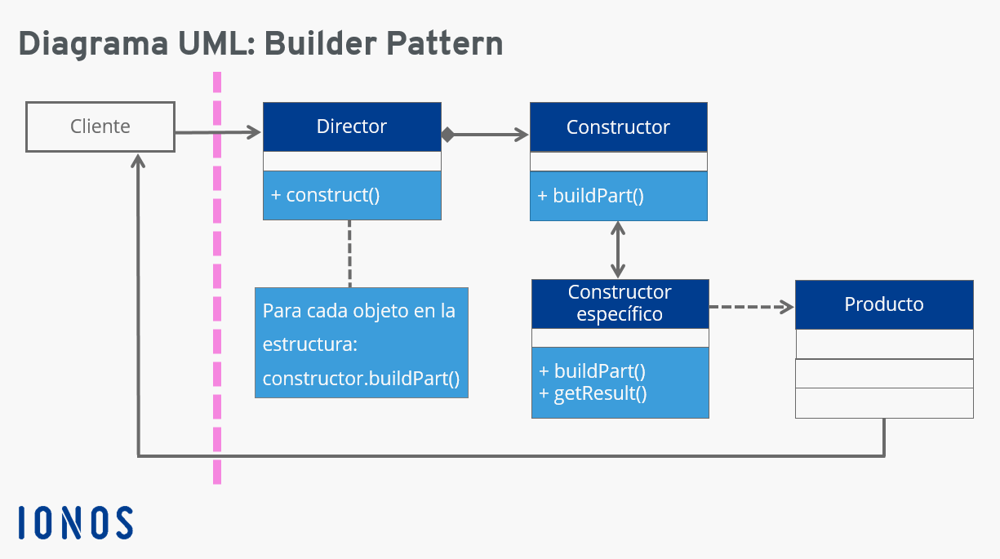

#Builder
"El patrón Builder o Constructor se utiliza cuando queremos crear un producto que tiene diferentes partes."

Para comprender mejor cómo funciona este patrón explicaremos cada componente:
- **Cliente**: Parte del programa que utilizará el resto de clases.
- **Director**: Clase que decide qué constructor se utiliza y cuando se debe construir el producto. 
- **IConstructor**: Interfaz que define las funciones de creación de cada parte del producto y la función de obtención del producto resultante. 
- **Constructor1 y Constructor2**: Clases encargadas de crear las partes del producto. 
- **Producto**: Clase del producto en sí. 

##El problema
- Imagina un objeto complejo que requiere una inicialización laboriosa, paso a paso, de muchos campos y objetos anidados. Normalmente, este código de inicialización está sepultado dentro de un monstruoso constructor con una gran cantidad de parámetros. O, peor aún: disperso por todo el código cliente.

##La Solución
- El patrón Builder sugiere que saques el código de construcción del objeto de su propia clase y lo coloques dentro de objetos independientes llamados constructores.

## Analogía de la vida real
- Mediante la implementación del patrón de diseño Builder podemos generar la construcción de un objeto complejo mediante la ayuda de una clase Builder, la cual nos permitirá crear la estructura completa de un empleado con todas sus dependencias, como lo son, su dirección, teléfonos, contactos, etc.

##Ejercicio

##Ventajas/Incovenientes
    + Puedes construir objetos paso a paso, aplazar pasos de la construcción o ejecutar pasos de forma recursiva.
    + Puedes reutilizar el mismo código de construcción al construir varias representaciones de productos.
    + Principio de responsabilidad única. Puedes aislar un código de construcción complejo de la lógica de negocio del producto.
    - La complejidad general del código aumenta, ya que el patrón exige la creación de varias clases nuevas.

##UML

Font: [IONOS](https://www.ionos.es/digitalguide/paginas-web/desarrollo-web/patron-de-diseno-builder/)

##Links

Link to [Refactoring Gurú](https://refactoring.guru/es/design-patterns/builder)

Link to [Cristalab](https://www.cristalab.com/tutoriales/patrones-de-diseno-creacionales-c99932l/)

Link ro [Reactive Programing](https://reactiveprogramming.io/blog/es/patrones-de-diseno/builder)